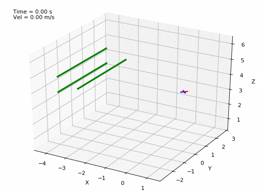

# Perception-Aware Perching on Powerlines with Multirotors
This repo contains the code for the NLP-based perching trajectory generation presented in our paper "Perception-Aware Perching on Powerlines with Multirotors". It also contains the following example trajectories:

Upside down             | 90º             |  90º (Perception Aware)
:-------------------------:|:-------------------------:|:-------------------------:
  |    |  

## Citing 
If you use this code in an academic context, please cite the following publication:

```
@article{paneque2022perching,
  title={Perception-Aware Perching on Powerlines with Multirotors},
  author={Paneque, J. L., Martínez-de-Dios, J. R., Ollero, A., Hanover, D., Sun, S., Romero, A. and Scaramuzza, D.},
  journal={IEEE Robotics and Automation Letters},
  year={2022}
}
```

## License 
MIT License. Copyright (C) 2022 Julio L. Paneque, Jose Ramiro Martínez de Dios and Anibal Ollero (GRVC Robotics Lab, Universidad de Sevilla) and Drew Hanover, Sihao Sun, Ángel Romero and Davide Scaramuzza (Robotics and Perception Group, University of Zurich).

This is research code, expect that it changes often and any fitness for a particular purpose is disclaimed.

This work has dependencies on other libraries which are individually cited when appearing.

## Requirements 
The code was tested with Ubuntu 18.04, Matlab R2020b, FORCESPRO 5.1.0, Casadi 3.5.1, g++ 10.3.0 and libYAML-cpp 0.5. Compatibility with other versions should be possible but is not tested.

## Installation and usage

### Generating the solver (`solver_generation`)
The NLP solver is generated and run using the FORCESPRO software (https://forces.embotech.com/). A free academic license of the software can be requested in [this link](https://my.embotech.com/auth/sign_up).

Once you have the license, install FORCESPRO following [these instructions](https://forces.embotech.com/Documentation/installation/obtaining.html), and then install the MATLAB client following [these instructions](https://forces.embotech.com/Documentation/installation/matlab.html). After that, navigate to the `solver_generation` folder and run:

```
generate_solver.m
```

This will generate all the required files and copy them to the `solver_interface` folder.

### Using the solver (`solver_interface`)

After the solver is generated, it can be used from the C++ interface to compute the required perching trajectories. To compile the interface, navigate to `solver_interface` and run:

```
g++ -o compute_perching_traj -Iinclude -std=c++17 src/perch_recovery_planner.cpp src/parameters/quad.cpp src/parameters/lines.cpp src/parameters/costs.cpp src/parameters/reference.cpp src/parameters/xinit.cpp extern/solver/PerchingSolver/lib/libPerchingSolver.so extern/solver/PerchingSolver_casadi2forces.c extern/solver/PerchingSolver_casadi.c -lm -lyaml-cpp
```
Once the code is compiled, it can be run given a path to a `YAML` file with the desired problem. This file provides the paths for the following sub-files (also in `YAML` format):

* The quadrotor parameters (`quad_config`)
* The powerlines setup (`lines_config`)
* The NLP costs for perching (`perching_costs`)
* The NLP costs for recovery (`recovery_costs`)
* The perching reference (`reference`)
* The starting position (`xinit`)

We provide the configuration files for three different perching maneuvers: **upside_down**, **90_deg_no_pa** and **90_deg_pa**. To run the first one, simply run: 

```
./compute_perching_traj config/upside_down.yaml
```
This will compute the maneuver and generate an `upside_down.csv` file in the current directory. We already provide the resulting `.csv` files of the three maneuvers so they can be seen without compiling any code. 

### Visualizing the results (`trajectory_visualization`)

We provide a optional python script to visualize the generated maneuvers in 3D animated plots. The required packages to run it are listed in `trajectory_visualization/requirements.txt`. The script takes as inputs the trajectory file, the quadrotor configuration file and the powerlines setup file. Additional arguments `--show_vel` and `--save` can be used to show the quadrotor velocity overtime and to save the resulting animation as a `gif` file (note: saving the animation will take some time before anything is shown).

You can play an example animation by running:
```
python visualize_trajectory.py -t ../solver_interface/upside_down.csv -q ../solver_interface/config/quad_parameters.yaml -l ../solver_interface/config/upside_down/line_parameters.yaml --show_vel
```

This will show an animation of the **upside_down** perching maneuver.